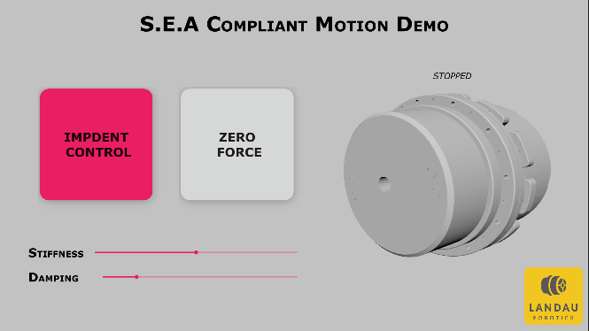
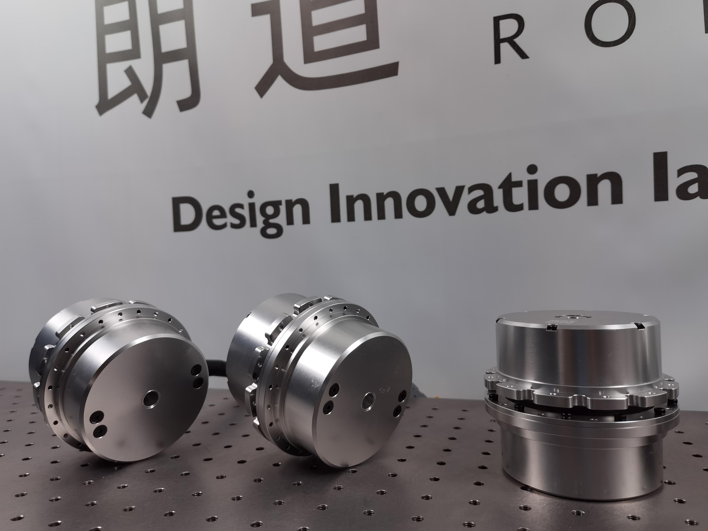
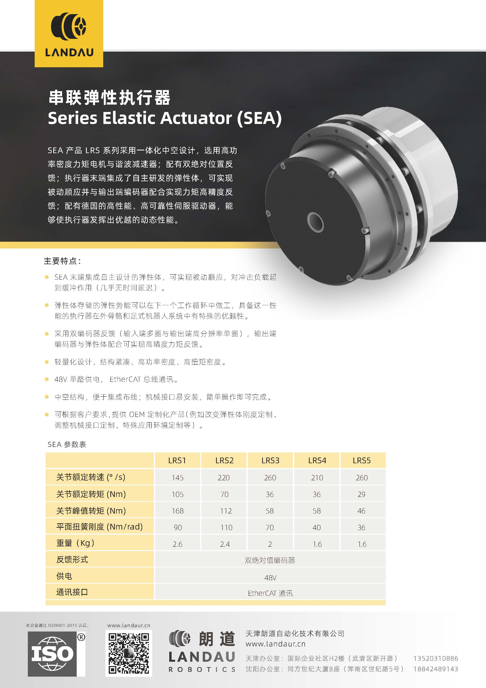

<div align="center">
  
  <h1>S.E.A Demo</h1>
  <blockquote>Series Elastic Actuator Compliant Motion Demo</blockquote>
</div>

# 简介

S.E.A Demo是一个用于展示由Landau Robotics（朗道）开发的串联弹性联轴器柔顺运动能力的示例程序。程序基于IgH EtherCAT Master以及Qt 6（Qt Quick）开发，经测试可以在Ubuntu 20.04上流畅运行。

 

# 效果演示

<iframe src="//player.bilibili.com/player.html?aid=742605928&bvid=BV1Gk4y1u7ni&cid=1170820209&page=1" scrolling="no" border="0" frameborder="no" framespacing="0" allowfullscreen="true"> </iframe>

# 功能说明

本例程使用的是由Landau Robotics（朗道）开发的LRS4型号SEA



其主要参数如下：




采用双绝对值编码器，配合经过分析验证的扭簧，能够实现高灵敏度的力感知，同时具备一定的被动柔顺能力，能够应对外部大冲击场景，适用于腿式机器人等场景。
# 编译及运行

本例程依赖IgH EtherCAT Master，具体安装配置可参考[landaurobotics/igh-ethercat-master](https://github.com/landaurobotics/igh-ethercat-master)的相关说明。

同时界面显示部分依赖Qt 6，主要用到了Qt Quick，因此需要安装Qt 6的相关组件，具体安装配置可参考[Qt官方文档](https://doc.qt.io/qt-6/gettingstarted.html)。

```bash
$ git clone https://github.com/landaurobotics/SeaDemo.git
$ cd SeaDemo
$ mkdir build && cd build
$ cmake ..
$ make
$ sudo ./SeaDemoApp
```

> 注意：需要使用sudo权限运行，否则无法访问EtherCAT设备。同时要确保主站已经启动`sudo /etc/init.d/ethercat status`。


---

如有问题或购买需求，可以联系我们。

公司官网：[www.landaur.cn](http://www.landaur.cn/)
